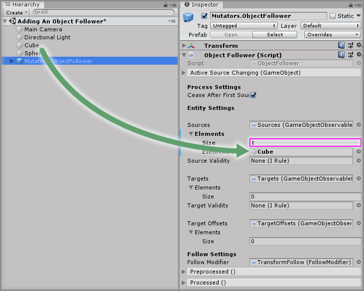
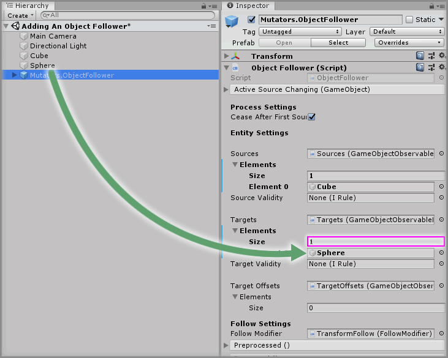
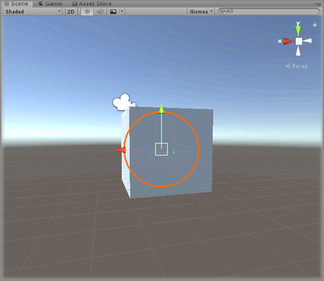
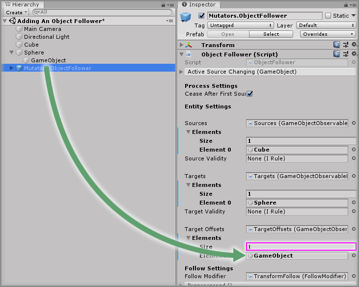
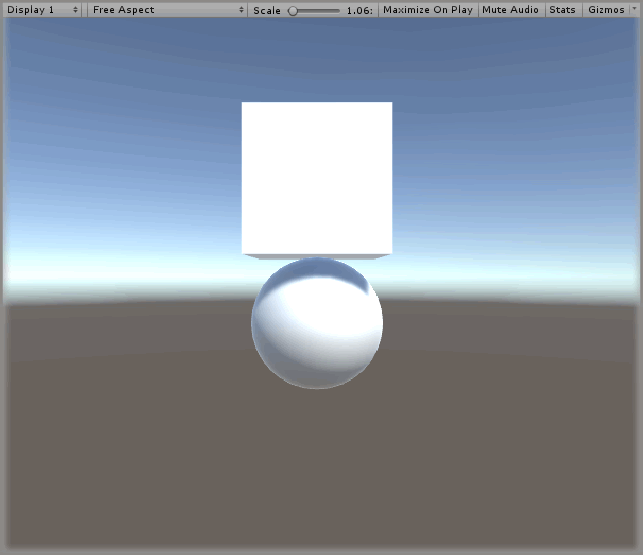

# Adding An Object Follower

> * Level: Beginner
>
> * Reading Time: 5 minutes
>
> * Checked with: Unity 2018.3.14f1

## Introduction

The purpose of the Object Follower prefab is the to have one or more GameObjects follow another GameObject around the [Unity] scene without the need to nest the GameObjects underneath each other.

## Prerequisites

* [Install the Tilia.Mutators.ObjectFollower.Unity] package dependency in to your Unity project.

## Let's Start

### Step 1

Create a new `Cube` Unity 3D Object by selecting `Main Menu -> GameObject -> 3D Object -> Cube` and change the `Transform` properties to:

* Position: `X = 0`, `Y = 0`, `Z = 0`

This will be used as the source GameObject to follow around the Unity scene.

### Step 2

Create a new `Sphere` Unity 3D Object by selecting `Main Menu -> GameObject -> 3D Object -> Sphere` and change the `Transform` properties to:

* Position: `X = 1`, `Y = 1`, `Z = 1`

This will be used as the target GameObject that will follow the source GameObject around the Unity scene.

### Step 3

Expand the `Tilia Mutators ObjectFollower Unity` package directory in the Unity Project window then select `Packages -> Tilia Mutators ObjectFollower Unity -> Runtime -> Prefabs` directory then drag and drop the `Mutators.ObjectFollower` prefab into the Hierarchy window.

### Step 4

Select the `Mutators.ObjectFollower` GameObject in the Unity Hierarchy window then increase the `Sources -> Elements -> Size` property by `1` on the `Object Follower` component.

> The size property will be `0` by default so change it to `1`.

Drag and drop the `Cube` GameObject from the Unity Hierarchy window into the newly displayed Element `0` field within the `Sources -> Elements` parameter on the `Object Follower` component.

### Step 5

Increase the `Targets -> Elements -> Size` property by `1` on the `Object Follower` component.

> The size property will be `0` by default so change it to `1`.

Drag and drop the `Sphere` GameObject from the Unity Hierarchy window into the newly displayed Element `0` field within the `Targets -> Elements` parameter on the `Object Follower` component.

Play the Unity scene and notice how the Sphere snaps to the same world position as the Cube. If you move the Cube around the Unity scene then the Sphere will follow it exactly and in real time.

### Step 6

We are now going to create an offset so when the Sphere follows the Cube, it is a slight distance away from the position of the Cube.

Create an empty GameObject as a child of the Sphere and change the `Transform` properties to:

* Position: `X = 0`, `Y = 1`, `Z = 0`

### Step 7

Select the `Mutators.ObjectFollower` GameObject in the Unity Hierarchy window then increase the `Target Offsets -> Elements -> Size` property by `1` on the `Object Follower` component.

> The size property will be `0` by default so change it to `1`.

Drag and drop the `Sphere -> GameObject` empty GameObject from the Unity Hierarchy window into the newly displayed Element `0` field within the `Target Offsets -> Elements` parameter on the `Object Follower` component.

### Done

Play the Unity scene and notice now has the Sphere still follows the Cube around the Unity scene, however the Sphere is offset underneath the Cube.

[Unity]: https://unity3d.com/
[Install the Tilia.Mutators.ObjectFollower.Unity]: ../Installation/README.md